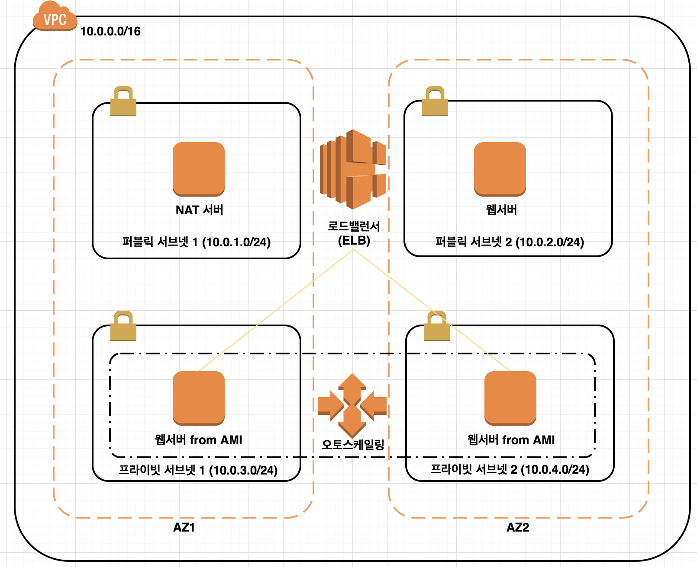

> # 1. 노드(NODE) 단위 오토스케일링

AWS 오토스케일링을 이용하여 노드단위 확장을 해본다.

## 우리가 만들 아키텍쳐
[]()

## 1-0. 서울 리전 선택

## 1-1. VPC 및 서브넷 생성

두개 AZ(가용영역)에 Public / Private Subnet 2개씩 설치

### 1-1-1. VPC 만들기 버튼 클릭
#### VPC with Public and Private Subnet 클릭 (두번째탭)
- IP CIDR BLOCK : 10.0.0.0/16
- VPC name : AS VPC
- Public subnet CIDR : 10.0.1.0/24
- 가용영역 (AZ) : 끝에가 a
- Public subnet name : 퍼블릭 서브넷1
- Private subnet CIDR : 10.0.3.0/24
- 가용영역 (AZ) : 끝에가 a
- Private subnet name : 프라이빗 서브넷1

#### Use a NAT instance instead 클릭
- t2.micro
- 키 페어 없음 선택해도 무관

### 1-1-2. 추가 서브넷 만들기

#### Public Subnet 만들기
- Subnet 생성 클릭
- Name tag : 퍼블릭 서브넷2
- VPC : AS VPC
- 가용영역 (AZ) : 끝에가 c
- CIDR : 10.0.2.0/24
- **만들고나서 라우팅 테이블을 eni에서 igw로 변경**

#### Private Subnet 만들기
- Subnet 생성 클릭
- Name tag : 프라이빗 서브넷2
- VPC : AS VPC
- 가용영역 (AZ) : 끝에가 c
- CIDR : 10.0.4.0/24

### 1-1-3. VPC 보안그룹 만들기
#### Security Group 클릭
- Name tag : WebSG
- Group name : WebSG
- Description : HTTP access
- VPC : AS VPC

#### Inbound Rule
- Type : HTTP(80)
  - Source : 0.0.0.0/0
- Type : SSH(22)
  - Source : 0.0.0.0/0


### 1-1-4. NAT EC2 태그정보 입력
- Key: Name
- Value : NAT

## 1.2. 웹서버 인스턴스 만들기

### 1.2.1 기본정보

- EC2 클릭
- Instance Type : t2.micro 선택
- 네트워크 : AS VPC
- Subnet : **퍼블릭 서브넷2**
- 퍼블릭 IP 자동 할당 : enable
- 고급 세부 정보 (Advanced Detailas) > User data
```shell
#!/bin/bash -ex
yum -y update
yum -y install httpd php mysql php-mysql
chkconfig httpd on
/etc/init.d/httpd start
if [ ! -f /var/www/html/lab2-app.tar.gz ]; then
cd /var/www/html
wget https://us-west-2-aws-staging.s3.amazonaws.com/awsu-ilt/AWS-100-ESS/v4.0/lab-2-configure-website-datastore/scripts/lab2-app.tar.gz
tar xvfz lab2-app.tar.gz
chown apache:root /var/www/html/lab2-app/rds.conf.php
fi
```

### 1.2.2 Next : Add Tags
- Key: Name
- Value : 웹서버

### 1.2.3 Next : Configure Security Group
- Select an existing security group 클릭
- WebSG 선택

### 1.2.4 웹서버 테스트
- Public DNS

## 1.3. 오토 스케일링 테스트

### 1.3.1 AMI 생성
- EC2 > 웹서버에서 마우스 오른쪽 버튼 클릭 > 이미지 생성 (Create Image)
- Image name : Webserver AMI
- Image Description : Webserver AMI

### 1.3.2 로드밸런서 추가

EC2 왼쪽 메뉴 > 로드밸런서 > 생성 버튼 클릭

#### 기본정보
- Create Load Balancer : Classic
- Load Balancer name : ELB
- AS VPC 선택
- Select Subnets : 퍼블릭 서브넷 2개 선택

#### Next: Assign Security Group
- default 해제
- WebSG 선택

#### Next: Configure Health Check
- Ping Path: /index.php
- Interval: 6
- Healthy Threshold: 2

#### Next: Add EC2 Instances
**SKIP**

#### 생성후 DNS Name으로 접속해보기


### 1.3.3 오토 스케일링 그룹 생성

#### 1.3.3.1 Launch Configuration (시작 구성)
- 시작 구성 생성 (Create launch configuration)
- My AMIs > 웹서버AMI 선택
- t2.micro
- 기본정보
 - Name: LConfig
 - Monitoring: Enable CloudWatch detailed monitoring
- Next: Configure security group
 - WebSG

#### 1.3.3.2 오토 스케일링 그룹정보 입력

기본정보 입력
- Group name : ASGroup
- Group size : 2개로 시작
- Network : AS VPC
- Subnet: 프라이빗 서브넷 두개 선택
- Advanced Details
 - 하나 이상의 로드 밸런서에서 트래픽 수신 (Receive traffic from one or more load balancers)
 - Classic Load Balancers : ELB
 - 상태 검사 유형 (Health Check Type) : ELB
 - Monitoring: Enable CloudWatch detailed monitoring 선택
- Next: 조정 정책 구성 (Configure scaling policies)
 - Use scaling policies to adjust the capacity of this group 선택
 - Scale between **2** and **6**

Increase 스케일링정책
- 그룹 크기 증가 (Increase Group Size) > Execute policy when
 - Add New Alarm 클릭
- 다음 정보 입력
 - Send a notification to : ASTopic
 - With these recipients: 이메일주소입력
 - Whenever: Average of CPU Utilization
 - Is >= 65 Percent
 - For at least: 1 consecutive period(s) of 1 minute
 - Name of alarm: HighCPU사용률
- Increase Group Size 추가정보 입력
 - Take the action: Add 선택, 1 입력, instances 선택, 65 입력
 - Instances need: 각 단계 후 준비에 60 초

Decrease 스케일링정책
- 그룹 크기 감소 (Decrease Group Size) > Execute policy when
 - Add New Alarm 클릭
- 다음 정보 입력
 - Whenever : Average of CPU Utilization
 - Is <= 20 Percent
 - For at least : 1 consecutive period(s) of 1 minute
 - Name of alarm : LowCPUUtilization
- Decrease Group Size 추가정보 입력
 - Take the action: Remove 선택, 1 입력, instances 선택, 20 입력

태깅정보입력
- Next: Configure Tags
 - Key: Name
 - Value: AS웹서버인스턴스

### 1.3.4 오토 스케일링 테스트
- 기입한 DNS주소를 기입한 브라우저창을 리프레시
- Load Test 버튼 클릭

## 동영상 튜토리얼 클릭
[](http://www.youtube.com/watch?v=72a9rQpjIR8)
