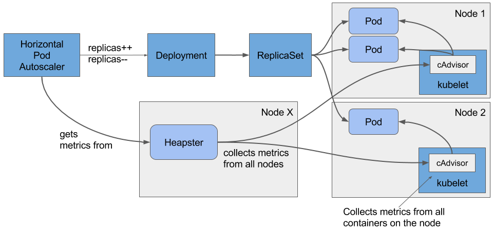

> # 2. 팟(POD) 단위 오토스케일링

Kubernetes Horizontal Pod Autoscaler를 이용한다.


[]()
[아키텍쳐]

[]()
[프로세스]

## 2-1. 환경설정
Google Cloud Platform을 이용한다

```shell
gcloud config set project 프로젝트명
gcloud config set compute/zone us-central1-a
gcloud container clusters create k8s-astest --num-nodes 5 --scopes "https://www.googleapis.com/auth/projecthosting,storage-rw"  --enable-network-policy
```

생성된 노드 확인
```shell
[~]$ kubectl get nodes
NAME                                        STATUS    ROLES     AGE       VERSION
gke-k8s-astest-default-pool-0847b08d-5dlw   Ready     <none>    2m        v1.9.7-gke.6
gke-k8s-astest-default-pool-0847b08d-fx5w   Ready     <none>    2m        v1.9.7-gke.6
gke-k8s-astest-default-pool-0847b08d-jjwv   Ready     <none>    2m        v1.9.7-gke.6
gke-k8s-astest-default-pool-0847b08d-tjwm   Ready     <none>    2m        v1.9.7-gke.6
gke-k8s-astest-default-pool-0847b08d-wvv6   Ready     <none>    2m        v1.9.7-gke.6
```

## 2-2. Pod Deploy & Service 생성 (ClusterIp)

```shell
$ kubectl run php-apache --image=k8s.gcr.io/hpa-example --requests=cpu=200m --expose --port=80
service/php-apache created
deployment.apps/php-apache created
```

> 참고 : index.php 내에는 CPU 부하를 유발시키는 코드가 들어있다
```
<?php
  $x = 0.0001;
  for ($i = 0; $i <= 1000000; $i++) {
    $x += sqrt($x);
  }
  echo "OK!";
?>
```

## 2-3. Horizontal Pod Autoscaler 생성


오토스케일 정책을 세운다. 이하 명령어는 cpu 사용률이 50%을 넘어가는 경우 최소 1개 Pod으로 시작하여 최대 10개까지 증가시킨다.

```shell
$ kubectl autoscale deployment php-apache --cpu-percent=50 --min=1 --max=10
horizontalpodautoscaler.autoscaling/php-apache autoscaled
```

초기는 0%
```shell
$ kubectl get hpa
NAME         REFERENCE                     TARGET    MINPODS   MAXPODS   REPLICAS   AGE
php-apache   Deployment/php-apache/scale   0% / 50%  1         10        1          18s
```

## 2-4. 부하 발생
배포된 서비스를 연속으로 호출하여 부하를 발생시킨다.
```shell
$ kubectl run -i --tty load-generator --image=busybox /bin/sh

Hit enter for command prompt

$ while true; do wget -q -O- http://php-apache.default.svc.cluster.local; done
```

CPU사용량이 증가하는 것을 볼 수 있다.
```
$ kubectl get hpa
NAME         REFERENCE                     TARGET      CURRENT   MINPODS   MAXPODS   REPLICAS   AGE
php-apache   Deployment/php-apache/scale   305% / 50%  305%      1         10        1          3m
```

임계치인 50%를 초과하여 시간이 지날수록 Pod의 개수가 늘어난다.
```
$ kubectl get deployment php-apache
NAME         DESIRED   CURRENT   UP-TO-DATE   AVAILABLE   AGE
php-apache   7         7         7            7           19m
```

## 2-5. 부하 발생 중단

busybox에서 도는 무한루프를 중단시키면, CPU의 부하가 감소하게 된다. 그리고 Pod의 개수는 줄어들어 다시 최종 한개만 남는다.

```shell
$ kubectl get hpa
NAME         REFERENCE                     TARGET       MINPODS   MAXPODS   REPLICAS   AGE
php-apache   Deployment/php-apache/scale   0% / 50%     1         10        1          11m

$ kubectl get deployment php-apache
NAME         DESIRED   CURRENT   UP-TO-DATE   AVAILABLE   AGE
php-apache   1         1         1            1           27m
```

## 시연클릭

[](http://www.youtube.com/watch?v=_4Xv9cufFFI)
